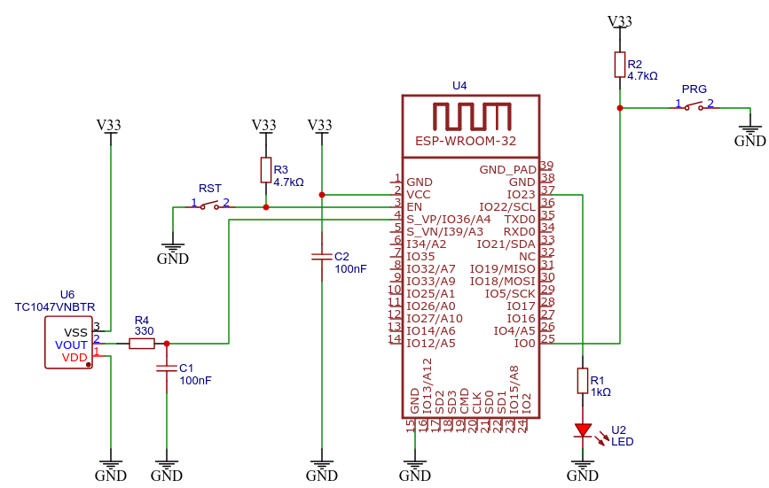

<h1>Catedra de Electrónica II</h1>
<h1>TP N°3 Conexión WiFi</h1>
<h2>Indice</h2>

- [Introducción](#introducción)
- [Circuito](#circuito)
- [Clonar el repositorio](#clonar-el-repositorio)
- [Licencia](#licencia)
- [Contacto](#contacto)


## Introducción
En este trabajo práctico se realizará un programa para que el ESP32 se conecte a una red WiFi y mantenga la conexión durante la ejeución del mismo. Además iniciará un access point que se utilizará en un portal embebido en el Trabajo Práctico Nº7.

La estructura ```config``` almacena los valores de configuración tanto de la red a conectar como los datos para el AP.

```cpp
struct Config {
  const char* device;
  const char* ssid;
  const char* ssid_pass;
  const char* ap_ssid;
  const char* ap_pass;
};
```

Estas variables se inicializarán con los valores que correspondan en ```setup.h```
```cpp
    //--Init wifi
    config.ssid="XXXX";
    config.ssid_pass="xxxxxxxx";
    config.ap_ssid=config.device;
    config.ap_pass="xxxxxxxx";
```

## Circuito
En la figura se aprecia el circuito de este trabajo práctico, el led conectado al pin físico 37 de la placa de desarrollo NODE-MCU32, que corresponde al puerto 23 (GPIO23) del microcontrolador, reflejará el estado de la conexión wifi.



Estos estados están definidos en la enumeración configurada en wifi.h
```cpp
enum FSM_WIFI_STATES {
    DISCONNECTED,
    CONNECTED,
    RECONNECT,
    WAITTORECONNECT,
    WAITFORCONNECT
};
```
Cada estado dispondrá de una codificación de flasheo del led (función _FSM_state_led() en wifi.cpp), los tiempos de encendido y apagado del les tonn y toff están dados en ms. La siguiente tabla muestra la codificaciónpara el estado de la conenxión.

<html>
    <table style="text-align: left;">
        <thead>
            <tr>
                <th>Estado</th>
                <th>tonn</th>
                <th>toff</th>
            </tr>
        </thead>
        <tr>
            <td>
            CONNECTED
            </td>
            <td>
            10000
            </td>
            <td>
            0
            </td>
        </tr>
        <tr>
            <td>
            DISCONNECTED
            </td>
            <td>
            0
            </td>
            <td>
            10000
            </td>
        </tr>
        <tr>
            <td>
            WAITTORECONNECT
            </td>
            <td>
            30
            </td>
            <td>
            30
            </td>
        </tr>
        <tr>
            <td>
            WAITFORCONNECT
            </td>
            <td>
            200
            </td>
            <td>
            200
            </td>
        </tr>
    </table>
</html>


## Clonar el repositorio
Abrir una terminal, dirigirse a la carpeta donde se encuentran los proyectos de Electrónica II y luego  correr el comando de git para clonar el repositorio.
El comando de clonación tiene la siguiente sintaxis:

```
git clone <https://github.com/nombre_de_usuario_github/repositorio> [directorio de destino]
```
Comandos para clonar este repositorio:
```
cd /home/admlca/electronicaII/platformio
git clone https://github.com/mcastellogh/UTN_EII_wifi wifi
```


## Licencia
Este proyecto está licenciado bajo GPLV3.

## Contacto
castello.marcelo@gmail.com